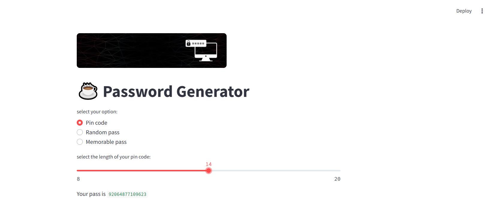

# Password Generator - Streamlit App

A simple Streamlit app to generate different types of passwords and PIN codes.

---

## Project Description

This project is an online tool that allows users to select and generate three types of passwords:

- **Pin code**: Generates a numeric PIN code with a customizable length (8 to 20)
- **Random pass**: Generates a random password with options to include numbers and symbols
- **Memorable pass**: Generates a memorable password composed of multiple words, with customizable number of words, separator, and capitalization options

---

## Requirements

- Python 3.7+
- Streamlit

---

## Installation and Running

```python
 pip install streamlit
 streamlit run dashboard.py

 ```
